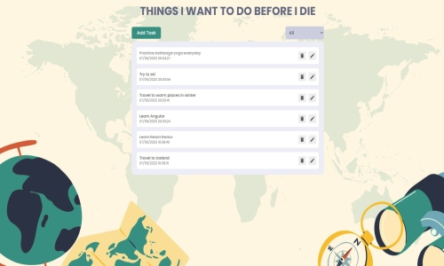
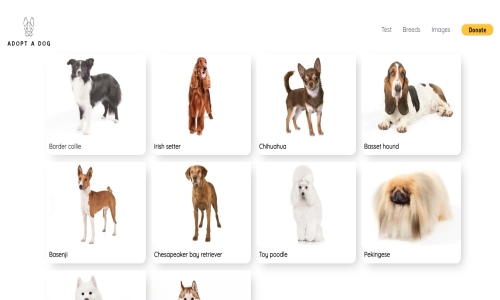
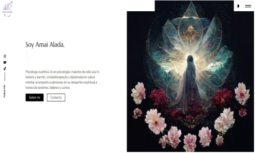
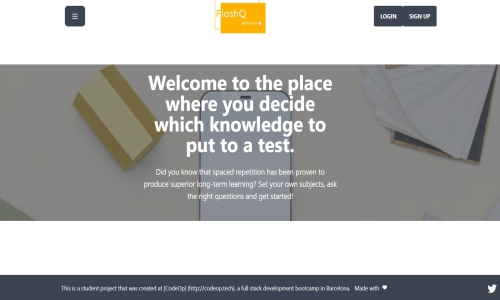

<!-- Main -->

  <ul class="cards">
    <li class="cards_item">
      

        

        

          <h2 class="card_title">WISHLIST</h2>
		  
React wishlist app using React Redux. 

		  <a href="https://github.com/Nikaishere/Wishlist" class="button">Github</a>
		   <a href="https://nikaishere.github.io/Wishlist/" class="button special">Demo</a>
        

      

    </li>
    <li class="cards_item">
      

        

        

          <h2 class="card_title">ADOPT A DOG</h2>
           
Full stack app using React,Node.js, and MySQL. 

          <a href="https://github.com/Nikaishere/AdoptADog" class="button">Github</a>
		   <a href="https://adoptadog.herokuapp.com/" class="button special">Demo</a>
        

      

    </li>
    <li class="cards_item">
      

         

        

          <h2 class="card_title">Amai Alada</h2>
           
Frontend app using Jekyll.

          <a href="https://github.com/Nikaishere/amaialada.github.io" class="button">Github</a>
		   <a href="https://nikaishere.github.io/amaialada.github.io/" class="button special">Demo</a>
        

      

    </li>
    <li class="cards_item">
      

        

        

          <h2 class="card_title">FlashQ</h2>
          
Full stack app using React, Node.js, and Tailwindcss (Final MVP).

           <a href="https://github.com/Nikaishere/FlashQ" class="button">Github</a>
		   <a href="https://flashq.herokuapp.com/" class="button special">Demo</a>
        

      

    </li>
  </ul>

				
					
			
	
	